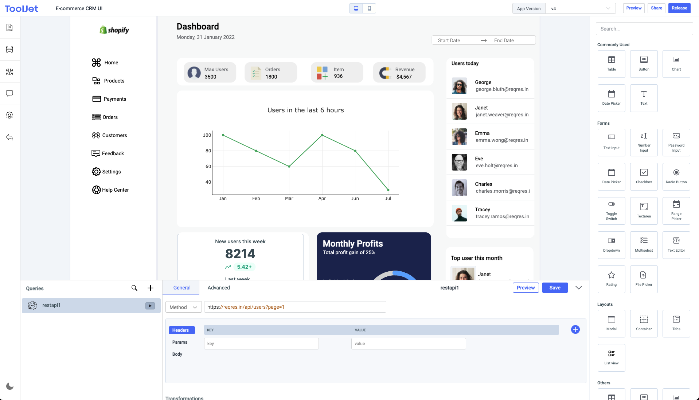

<!--
Ohart ongi: README hau automatikoki sortu da <https://github.com/YunoHost/apps/tree/master/tools/readme_generator>ri esker
EZ editatu eskuz.
-->

# ToolJet YunoHost-erako

[](https://dash.yunohost.org/appci/app/tooljet)  

[](https://install-app.yunohost.org/?app=tooljet)

*[Irakurri README hau beste hizkuntzatan.](./ALL_README.md)*

> *Pakete honek ToolJet YunoHost zerbitzari batean azkar eta zailtasunik gabe instalatzea ahalbidetzen dizu.*  
> *YunoHost ez baduzu, kontsultatu [gida](https://yunohost.org/install) nola instalatu ikasteko.*

## Aurreikuspena

ToolJet is an open-source low-code framework to build and deploy internal tools quickly without much effort from the engineering teams. You can connect to your data sources, such as databases (like PostgreSQL, MongoDB, Elasticsearch, etc), API endpoints (ToolJet supports importing OpenAPI spec & OAuth2 authorization), and external services (like Stripe, Slack, Google Sheets, Airtable) and use our pre-built UI widgets to build internal tools.

### Features

- *Visual app builder:* 35+ built-in responsive widgets such as Tables, Charts, Lists, Forms, Progressbars, and more.
- *20+ data sources:* connect to databases, cloud storages and APIs.
- *Desktop & mobile*: ;layout widths can be customised to support different screens. 
- *Collaborate:* add comments anywhere on the canvas and tag your team members.
- *Extend with plugins:*: use our [commandline tool](https://www.npmjs.com/package/tooljet) to easily boostrap new connectors.
- *Version control:* every application have different versions with proper release cycle.
- *Run JS code:* ability custom JavaScript snippets
- *Granular access control* on organization-level and app-level.
- *low-code:* write JS code almost anywhere in the builder. For example, the color property of text can be set to `status === 'success' ? 'green' : 'red'`
- *no-code query editors* for all supported data sources.
- *Join and transform data:* transform query results using just JavaScript code. 
- *Secure:* All the credentials are securely encrypted using `aes-256-gcm`.
- *Doesn't store data:* ToolJet acts only as a proxy and doesn't store any data.


**Paketatutako bertsioa:** 2.34.2~ynh1

## Pantaila-argazkiak



## Dokumentazioa eta baliabideak

- Aplikazioaren webgune ofiziala: <https://tooljet.com/>
- Erabiltzaileen dokumentazio ofiziala: <https://docs.tooljet.com/docs/intro>
- Jatorrizko aplikazioaren kode-gordailua: <https://github.com/ToolJet/ToolJet>
- YunoHost Denda: <https://apps.yunohost.org/app/tooljet>
- Eman errore baten berri: <https://github.com/YunoHost-Apps/tooljet_ynh/issues>

## Garatzaileentzako informazioa

Bidali `pull request`a [`testing` abarrera](https://github.com/YunoHost-Apps/tooljet_ynh/tree/testing).

`testing` abarra probatzeko, ondorengoa egin:

```bash
sudo yunohost app install https://github.com/YunoHost-Apps/tooljet_ynh/tree/testing --debug
edo
sudo yunohost app upgrade tooljet -u https://github.com/YunoHost-Apps/tooljet_ynh/tree/testing --debug
```

**Informazio gehiago aplikazioaren paketatzeari buruz:** <https://yunohost.org/packaging_apps>
